# Лабораторная работа №5. Облачные базы данных. Amazon RDS, DynamoDB

## Цель работы

Целью работы является ознакомиться с сервисами Amazon RDS (Relational Database Service) и Amazon DynamoDB, а также научиться:

- Создавать и настраивать экземпляры реляционных баз данных в облаке AWS с использованием Amazon RDS.
- Понимать концепцию Read Replicas и применять их для повышения производительности и отказоустойчивости баз данных.
- Подключаться к базе данных Amazon RDS с виртуальной машины EC2 и выполнять базовые операции с данными (создание, чтение, обновление, удаление записей - CRUD).
- (_Дополнительно_) Ознакомиться с сервисом Amazon DynamoDB и освоить работу с хранением данных в NoSQL-формате.

# Практическая часть

### Шаг 1. Подготовка среды (VPC/подсети/SG)

### Создала VPC `project-vpc`:

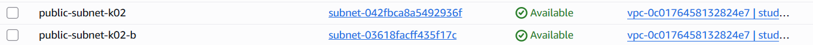

- 2 публичные подсети (в разных AZ)
- 2 приватные подсети (в разных AZ)

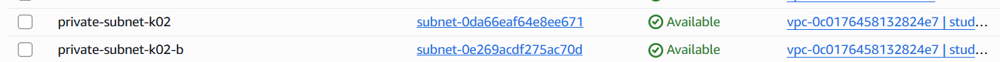

### Создала Security Groups:

#### **1. web-sg-k02**

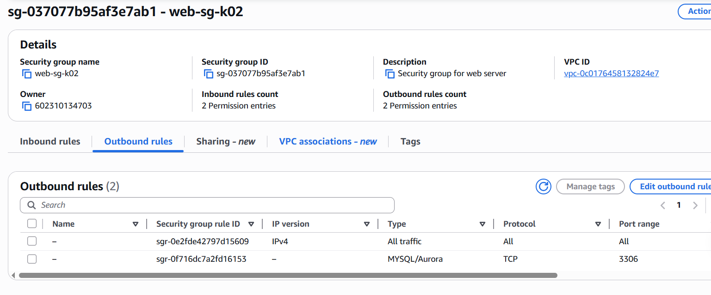

> Вернее сказать, было взято из предыдущих лабораторных web-sg-k02, так как подходит по условию лабораторной.

**Inbound:**

- HTTP 80 → 0.0.0.0/0
- SSH 22 → мой IP (или 0.0.0.0/0 для учебных целей)

#### **2. db-server-maria**

> Вернее сказать, было взято из предыдущих лабораторных db-server-maria, так как подходит по условию лабораторной.

**Inbound:**

- MySQL 3306 → _web-sg-k02_

#### **Outbound (добавлено в web-security-group):**

- MySQL 3306 → _db-server-maria_

Это обеспечивает доступ к базе данных **только** с веб-сервера.

### Шаг 2. Развертывание Amazon RDS

### Создана Subnet Group:

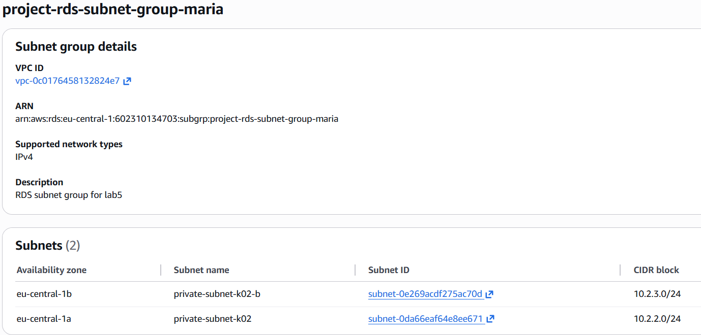

- Название: `project-rds-subnet-group-maria`
- Включает **2 приватные подсети** в разных AZ
- Используется RDS для корректного размещения инстанса

### Что такое Subnet Group? И зачем необходимо создавать Subnet Group для базы данных?

**DB Subnet Group** — это логическое объединение _двух или более приватных подсетей_ в рамках одной VPC, в разных Availability Zone.

По сути, это список подсетей, в которых **разрешено** размещать экземпляры Amazon RDS.

## Зачем необходимо создавать Subnet Group для базы данных?

Amazon RDS **обязательно** требует DB Subnet Group, потому что:

1. **RDS должен находиться минимум в двух приватных подсетях** — для отказоустойчивости и возможности резервирования.
2. AWS выбирает из Subnet Group подсети для размещения БД и её реплик.
3. Без Subnet Group RDS не знает, _где именно_ в VPC можно создать базу данных.

### Создала экземпляр RDS MySQL

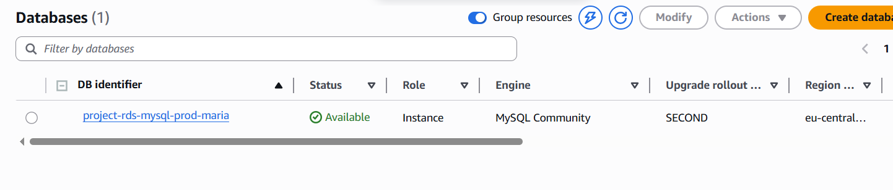

Основные параметры:

| Параметр         | Значение                       |
| ---------------- | ------------------------------ |
| Engine           | MySQL 8.0.42                   |
| Template         | Free Tier                      |
| Deployment       | Single-AZ                      |
| Identifier       | `project-rds-mysql-prod-maria` |
| Master username  | admin                          |
| Storage          | 20GB gp3                       |
| Autoscaling      | Enabled                        |
| Public Access    | No                             |
| Security Groups  | db-mysql-security-group        |
| Initial database | `project_db_maria`             |

После создания инстанс получил статус **Available**, а я скопировала его **Endpoint**.

## Шаг 3. Создание виртуальной машины EC2

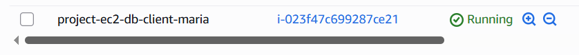

Использовала публичную подсеть + web-sg-k02.

User Data для установки MySQL клиента:

```bash
#!/bin/bash
dnf update -y
dnf install -y mariadb105
```

После запуска — подключилась по SSH.

### Шаг 4. Подключение к базе данных и выполнение базовых операций

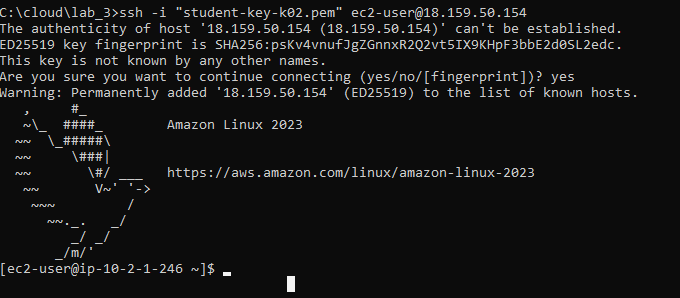

Подключение к RDS:

```bash
mysql -h <ENDPOINT> -u admin -p
```

Выбор БД:

```sql
USE project_db;
```

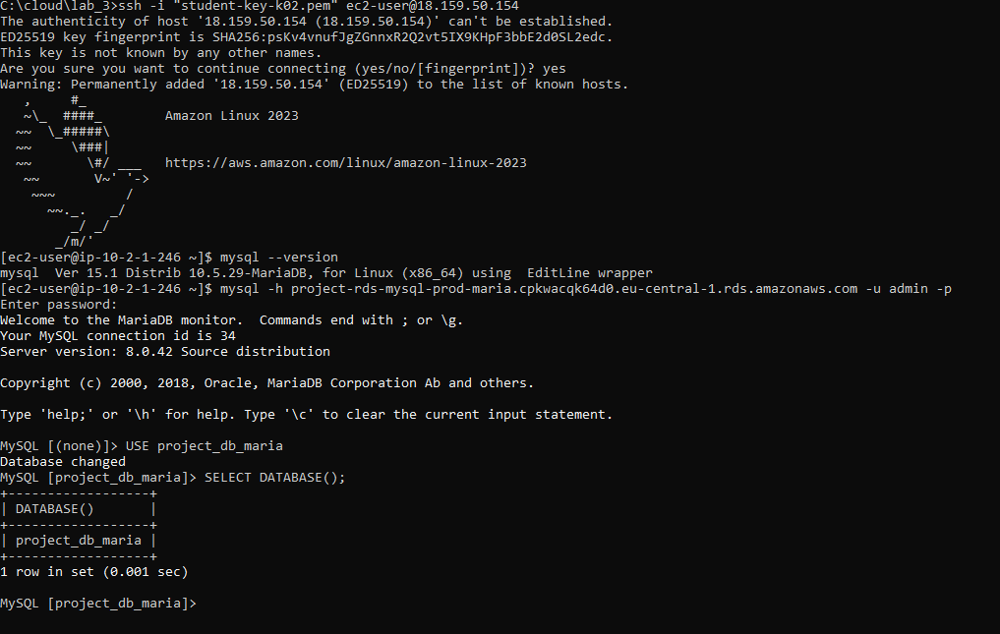

### Создала таблицы:

#### categories

```sql
CREATE TABLE categories (
  id INT AUTO_INCREMENT PRIMARY KEY,
  name VARCHAR(100) NOT NULL
);
```

#### todos

```sql
CREATE TABLE todos (
  id INT AUTO_INCREMENT PRIMARY KEY,
  title VARCHAR(255) NOT NULL,
  status VARCHAR(20) NOT NULL,
  category_id INT,
  FOREIGN KEY (category_id) REFERENCES categories(id)
);
```

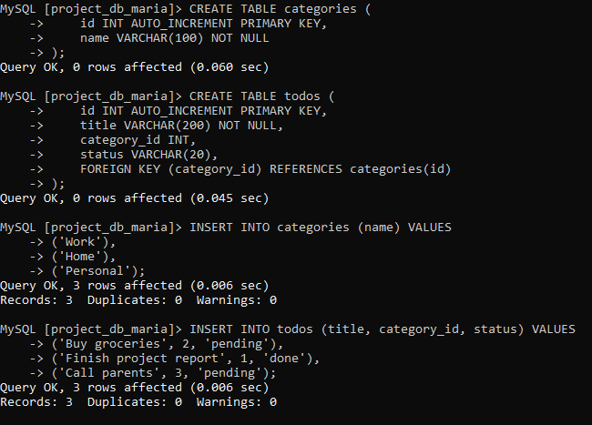

### Добавила записи:

```sql
INSERT INTO categories (name) VALUES ('Home'), ('Work'), ('Personal');
INSERT INTO todos (title, status, category_id)
VALUES
 ('Wash dishes', 'pending', 1),
 ('Finish report', 'done', 2),
 ('Buy groceries', 'pending', 3);
```

### Выполнила JOIN:

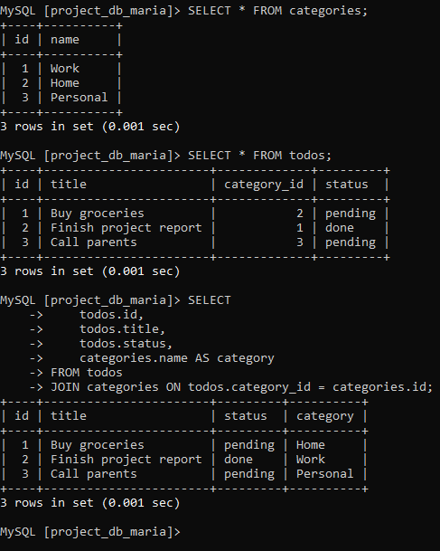

```sql
SELECT t.id, t.title, t.status, c.name AS category
FROM todos t
JOIN categories c ON t.category_id = c.id;
```

### Шаг 5. Создание Read Replica

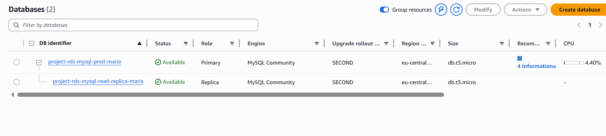

Создала Read Replica:

- Identifier: `project-rds-mysql-read-replica-maria`
- Class: `db.t3.micro`
- Storage: gp3
- Public access: No
- Security group: db-mysql-security-group

### Подключилась к реплике:

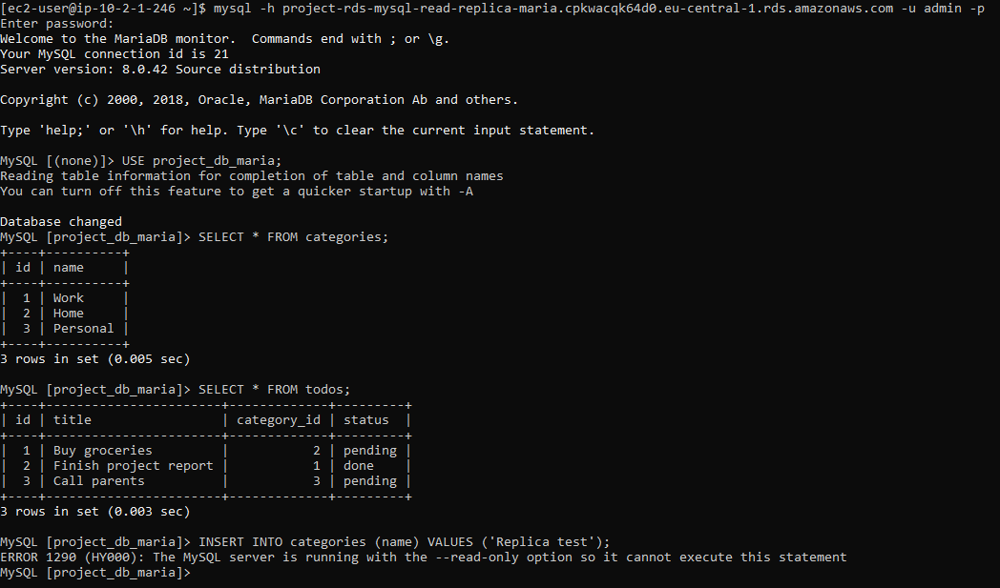

```bash
mysql -h <REPLICA_ENDPOINT> -u admin -p
```

## Какие данные вы видите? Объясните почему.

После подключения к Read Replica и выполнения `SELECT`-запросов отображаются **все данные, которые находятся на основном (Primary) экземпляре базы данных** на момент репликации.

## Почему так происходит?

Потому что **Read Replica получает данные из Primary автоматически** с помощью механизма **асинхронной репликации MySQL**.

Primary выполняет все операции записи (INSERT/UPDATE/DELETE).
Read Replica постоянно копирует изменения в фоновом режиме.
Поэтому Replica _всегда содержит копию данных_ из Primary.

### Проверила чтение:

```sql
SELECT * FROM categories;
```

Все данные присутствуют — реплика синхронизирована.

### Проверила запись:

```sql
INSERT INTO categories (name) VALUES ('TestReplica');
```


Ошибка:

```
ERROR 1290: The MySQL server is running with the --read-only option
```

## Получилось ли выполнить запись на Read Replica? Почему?

**Нет, выполнить запись на Read Replica не получилось.**

При попытке выполнить `INSERT`, `UPDATE` или `DELETE` сервер возвращает ошибку:

```
ERROR 1290 (HY000): The MySQL server is running with the --read-only option
```

## Почему это происходит?

Потому что **Read Replica работает в режиме только для чтения (read-only)**.

AWS специально блокирует любые операции записи, чтобы:

- защитить данные от случайных изменений,
- сохранить целостность репликации,
- гарантировать, что только Primary управляет изменениями,
- избежать конфликтов и расхождения данных.

Read Replica предназначена **только для SELECT-запросов** — она снижает нагрузку на Primary и ускоряет чтение данных.

### Добавила запись на основной БД:

```sql
INSERT INTO categories (name) VALUES ('FromPrimary');
```

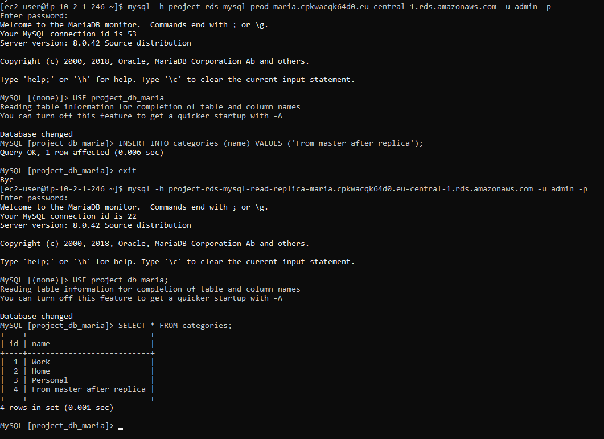

Затем снова проверила реплику:

Новая запись появилась — реплика получила изменения.

## Отобразилась ли новая запись на реплике? Объясните почему.

**Да, новая запись появилась на Read Replica.**

## Почему это произошло?

Потому что Read Replica получает данные с Primary с помощью **асинхронной репликации MySQL**:

1. Сначала запись создаётся в основной базе (Primary).
2. Затем изменения автоматически передаются (реплицируются) на реплику.
3. Через короткую задержку (обычно 1–2 секунды) новая запись появляется на Read Replica.

## Объясните, зачем нужны Read Replicas и в каких сценариях их использование будет полезным.

**Read Replicas нужны для масштабирования нагрузки на базу данных и повышения отказоустойчивости.**
Они создают одну или несколько копий основной базы, предназначенных _только для чтения_.

### Где это полезно?

### **1. Масштабирование чтения (повышение производительности)**

Когда приложение выполняет много `SELECT`-запросов (например, сайт с большим количеством пользователей), чтение можно распределить между несколькими репликами.

**Преимущество:** Primary обслуживает только записи, уменьшается нагрузка.

### **2. Отказоустойчивость (резервное чтение)**

Если основной сервер временно недоступен, приложение всё ещё может читать данные с реплики.

## Шаг 6. Подключение приложения

Выбрала вариант **6a — простое CRUD PHP приложение**.

Создала структуру:

```
/var/www/html/
  index.php
  db.php
```

### Использовала два подключения:

#### Для записи (master DB):

```
DB_HOST_WRITE = <PRIMARY_ENDPOINT>
```

#### Для чтения (read replica):

```
DB_HOST_READ = <REPLICA_ENDPOINT>
```

PHP код подключается по принципу:

```php
if ($action === 'read') {
    $pdo = new PDO($readDsn, $user, $pass);
} else {
    $pdo = new PDO($writeDsn, $user, $pass);
}
```
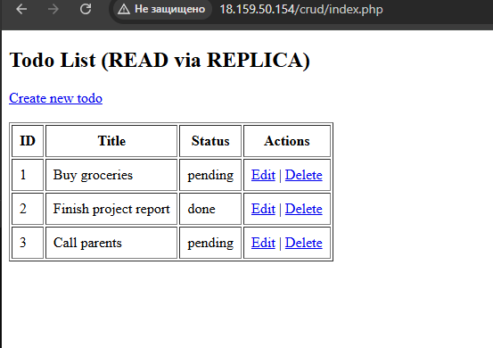

# Ответы на контрольные вопросы

### Что такое Subnet Group?

Это набор приватных подсетей, в которых разрешено размещение инстанса RDS.

### Какие данные видны на Read Replica?

Только данные, которые были записаны в основной БД — реплика автоматически их получает.

### Почему на реплике нельзя выполнять запись?

Потому что реплика работает в режиме `read-only`.

### Зачем нужны Read Replicas?

- масштабирование нагрузки (разделение чтения и записи)
- резервное копирование
- повышение отказоустойчивости

### Шаг 7. Дополнительное задание. Использование DynamoDB

1. Для реализации дополнительного задания была спроектирована NoSQL-таблица Todos в Amazon DynamoDB.

**Структура таблицы**
- **Название:** `TodosDDB`
- **Primary Key:** `id` (тип: String)

**Обоснование выбора ключа**
- `id` — уникальный идентификатор задачи (task).
- Тип String удобен для UUID.
- В данном сценарии нет необходимости в Sort Key, так как каждая запись является самостоятельной сущностью.


2. Создание таблицы DynamoDB

Таблица создана через AWS Console:
1. Открыто меню DynamoDB → Tables → Create table
2. Задано:
- Table name: `TodosDDB`
- Partition key:
    - `id` (String)
3. Остальные параметры оставлены по умолчанию.

3. Добавление тестовых записей

Через AWS Console → Explore table items → Create item
Добавлены тестовые задачи:

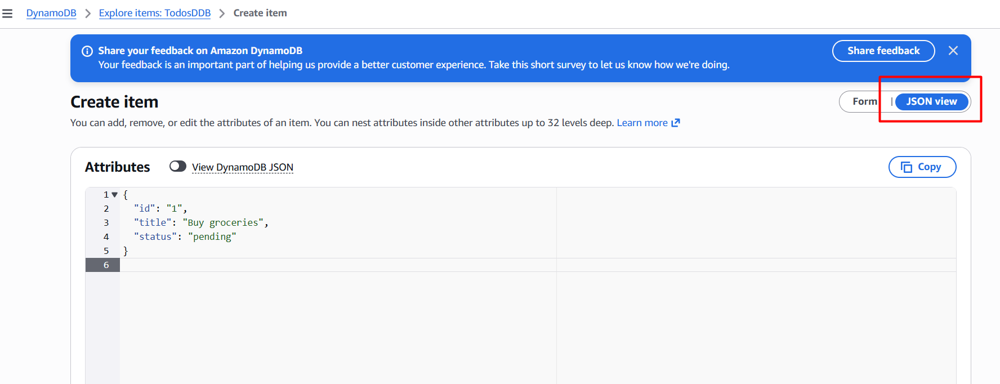

Пример:
```javascript
{
  "id": "1",
  "title": "Buy groceries",
  "status": "pending"
}
```
После чего было добавлено еще несколько записей для наглядности, все в формате JSON.

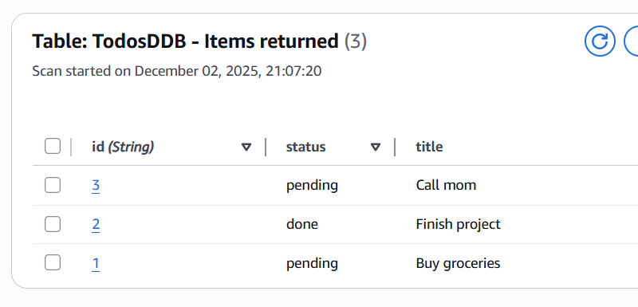

4. Подключение приложения к DynamoDB

На виртуальную машину EC2 установлен AWS SDK:
```bash
composer require aws/aws-sdk-php
```
Создан файл `dynamodb.php` с реализацией клиентского кода:
**Реализовано:**
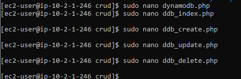
- подключение к DynamoDB через AWS SDK
- CRUD-функции:
  - `ddb_get_all()` — чтение всех задач
  - `ddb_create()` — создание новой записи
  - `ddb_update()` — обновление записи
  - `ddb_delete()` — удаление записи

Исправлена интеграция с автозагрузчиком Composer.

5. Созданы web-страницы для DynamoDB.

В папке `/var/www/html/crud/` добавлены файлы:
- `ddb_index.php` — список записей из DynamoDB
- `ddb_create.php` — форма для создания
- `ddb_update.php` — обновление задачи
- `ddb_delete.php` — удаление
- `ddb_test.php` — тест клиента SDK

Все страницы корректно работают через браузер:

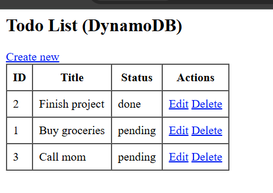

**Выполнена интеграция CRUD → DynamoDB**

*Все операции работают:*
- **Чтение** - Отображение всех элементов таблицы.
- **Создание** - Через форму добавляется новая запись, генерируется UUID или ID, сохраняется в DynamoDB.
- **Обновление** - Запись обновляется через UpdateExpression.
- *Удаление* - Элемент удаляется по ключу.

Все операции протестированы — выполняются успешно.

**Преимущества и недостатки DynamoDB**

**Преимущества**
- *Масштабируется автоматически* — можно хранить миллионы записей без администрирования.
- *Очень высокая производительность* — миллисекундная задержка.
- *Полностью управляемая база* — не нужно обновлять, настраивать, администрировать сервер.
- *Гибкая модель данных* — не требует заранее заданной схемы.

**Недостатки**
- *Нет JOIN* — связи Many-To-One отсутствуют.
- *Сложно моделировать сложные структуры данных.*
- *Стоимость расчётная (RCU/WCU)* — важно оптимизировать запросы.
- *Труднее мигрировать данные* по сравнению с RDS.

**Какие сложности возникли при проектировании?**
**RDS (MySQL)**
*Используется для:*
- связанных данных
- категорий, пользователей
- сложных запросов, JOIN’ов
- транзакций

**DynamoDB**
*Используется для:*
- быстрых операций
- больших объёмов данных
- событий, логов, настроек
- кэширования или хранения “плоских” объектов

**Пример комбинированной архитектуры**
| Функция           | Где хранится |
| ----------------- | ------------ |
| Пользователи      | RDS          |
| Категории задач   | RDS          |
| Задачи (Todo)     | DynamoDB     |
| Активность / логи | DynamoDB     |

*Такой гибрид даёт:*
- высокую скорость для задач
- надёжные связи и транзакции для пользователей
- малые затраты на масштабирование

# Вывод

В ходе работы я:

- создала облачную инфраструктуру (VPC, subnets, SG);
- развернула реляционную базу данных в Amazon RDS;
- настроила подключение с EC2 и выполнила CRUD операции;
- создала Read Replica и проверила механизм репликации;
- разработала простое CRUD приложение, использующее master и replica;
- изучила и применила Amazon DynamoDB.

Работа позволила понять принципы работы облачных баз данных, сетевых конфигураций AWS и различия реляционных и нереляционных хранилищ.

